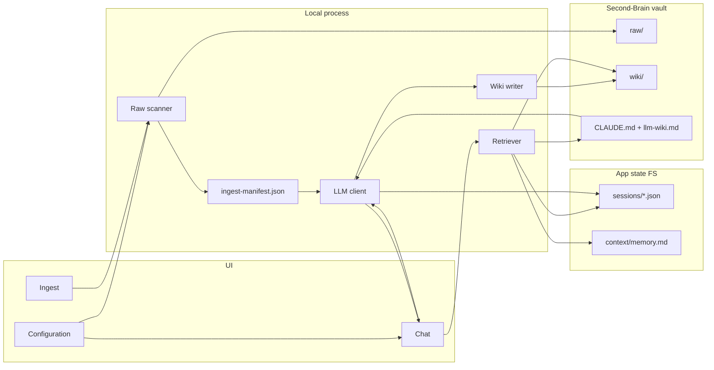
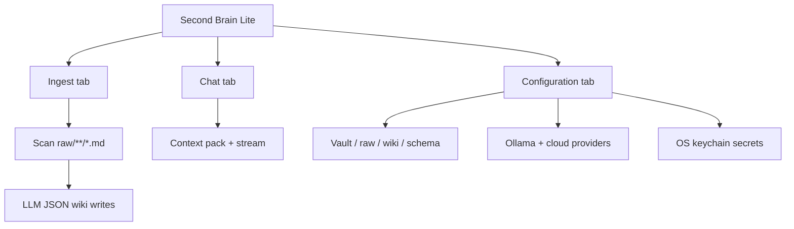
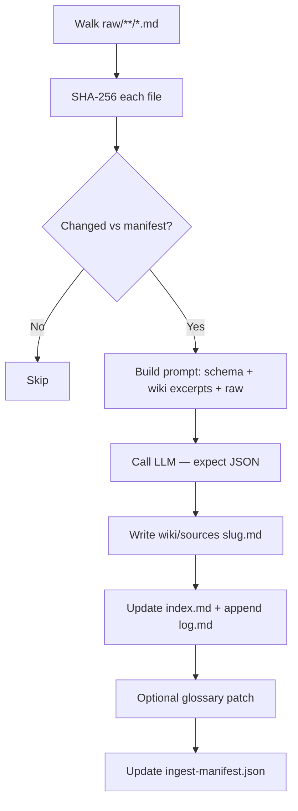
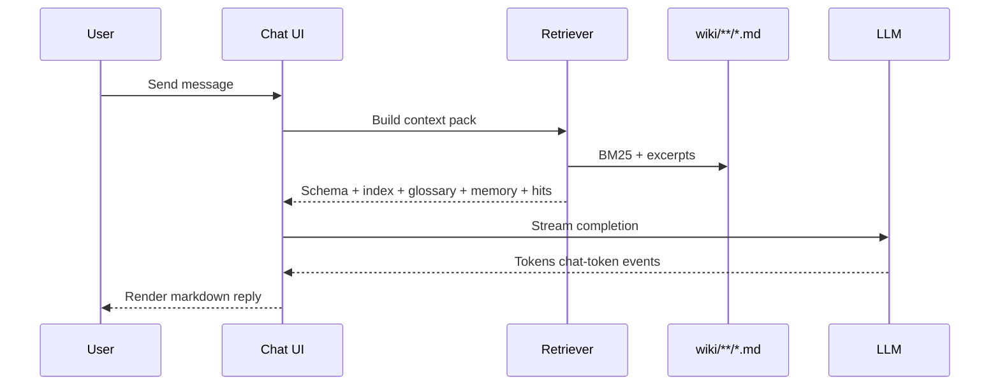
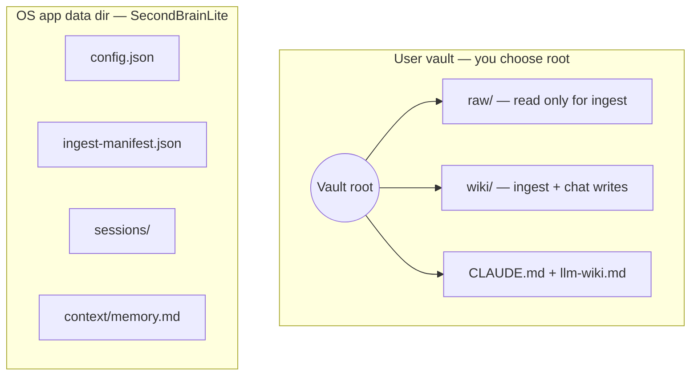

# Second Brain Lite

Local-first desktop companion for turning Markdown in **`raw/`** into a structured **`wiki/`**, with retrieval-grounded **chat** — powered by **Tauri 2**, **React**, and **Rust**. No database: everything lives on disk (vault Markdown + app data under your OS application support folder).

---

## Table of contents

- [What it does](#what-it-does)
- [Architecture](#architecture)
- [How ingest works](#how-ingest-works)
- [How chat works](#how-chat-works)
- [Vault vs app data](#vault-vs-app-data)
- [Who it's for](#who-its-for)
- [Prerequisites](#prerequisites)
- [Quick start](#quick-start)
- [Configuration reference](#configuration-reference-technical)
- [Environment variables](#environment-variable-overrides)
- [Secrets and threat model](#secrets-and-threat-model)
- [API keys and providers](#api-keys-and-providers)
- [Building from source](#building-from-source)
- [Publishing to GitHub](#publishing-to-github)
- [Troubleshooting](#troubleshooting)
- [Contributing and license](#contributing-and-license)

---

## What it does

**In plain language:** Drop Markdown notes into **`raw/`**; Second Brain Lite helps turn them into a structured **`wiki/`** (summary pages, index updates, log entries) and gives you a **chat** window that answers using your wiki as context — not from scratch each time.

**Technical snapshot:** **Tauri 2 + React + Vite** frontend, **Rust** backend. Ingest and chat load **`CLAUDE.md`** and **`llm-wiki.md`** from your configured **schema directory** as the maintainer “contract”. Chat uses lightweight **BM25-style retrieval** over `wiki/**/*.md`. Streaming replies use Tauri events (`chat-token`) until completion.

---

## Architecture

High-level data flow between the UI, local process, your vault, and app state:



Tab shell:



---

## How ingest works



Steps in prose:

1. Walk `raw/**/*.md`, SHA-256 each file.
2. Skip unchanged entries vs `ingest-manifest.json`.
3. Call the active LLM with **`CLAUDE.md` + `llm-wiki.md` + wiki excerpts + raw content**.
4. Expect **JSON** from the model (`slug`, `title`, `one_line_summary`, `body_markdown`, `tags`, optional `glossary_patch`).
5. Write `wiki/sources/<slug>.md`, update `wiki/index.md`, append `wiki/log.md`, optionally extend `glossary.md`.
6. Update manifest.

Toggle **Full tier** in the UI for stronger glossary prompting.

---

## How chat works



Each message builds a context pack: schema docs, index/glossary excerpts, BM25 retrieval hits over `wiki/**/*.md`, rolling `context/memory.md`, and recent turns.

**Save answer to wiki** writes `wiki/analyses/<slug>.md` with analysis frontmatter and updates index/log.

**Update rolling memory** summarizes recent chat into `context/memory.md`.

---

## Vault vs app data



Paths **`raw/`**, **`wiki/`**, and **schema** are configurable (folder picker + overrides). App state **never** replaces your vault; it lives beside other desktop apps’ data.

---

## Who it's for

- Obsidian / Markdown vault users who want LLM-assisted **wiki ingest + query**.
- Developers running **local Ollama** or **cloud models** who prefer filesystem-backed KBs over Postgres/RAG stacks.

---

## Prerequisites

| Requirement | Notes |
|-------------|--------|
| **Node.js** | 18 or newer recommended |
| **Rust** | Stable toolchain via [rustup](https://rustup.rs/) |
| **Platform tooling** | e.g. Xcode Command Line Tools on **macOS**; MSVC build tools on **Windows**; usual build essentials on **Linux** |

---

## Quick start

1. Clone the repo (after you [publish to GitHub](#publishing-to-github) or from your fork):

   ```bash
   git clone https://github.com/<your-username>/second-brain-lite.git
   cd second-brain-lite
   ```

2. Install JavaScript dependencies:

   ```bash
   npm install
   ```

3. Run the desktop app in development mode:

   ```bash
   npm run tauri:dev
   ```

4. Open **Configuration**:
   - Choose **Operating system hint** (or leave **Match this computer**).
   - Click **Choose folder…** and pick where your vault should live.
   - Click **Setup** — creates **`raw/`** and **`wiki/`** under that folder and saves paths.
   - Click **Copy template schemas** if `CLAUDE.md` / `llm-wiki.md` are missing (bundled templates ship in this repo).
   - Pick provider (**Ollama**, OpenAI, Anthropic, or OpenAI-compatible), enter models, **Save API keys** (stored in the OS keychain where supported).
   - Click **Save configuration**.

5. Put Markdown sources under **`raw/`**, open **Ingest**, run **Run ingest**.

6. Open **Chat**, pick **New chat**, ask questions grounded in the wiki.

---

## Configuration reference (technical)

| Item | GUI | Persistent JSON |
|------|-----|-------------------|
| OS hint | Configuration tab | `osHint` in `config.json` |
| Vault root | Folder picker | `vaultRoot` |
| `raw/` path | Advanced overrides | `rawDir` |
| `wiki/` path | Advanced overrides | `wikiDir` |
| Schema dir (`CLAUDE.md`, `llm-wiki.md`) | Usually vault root | `schemaDir` |
| Models / provider | Configuration tab | `defaultProvider`, `ollamaBaseUrl`, `openaiModel`, … |

App data directory (from Rust [`dirs::data_local_dir()`](https://docs.rs/dirs/latest/dirs/fn.data_local_dir.html) + `SecondBrainLite/`):

- **macOS:** `~/Library/Application Support/SecondBrainLite/`
- **Windows:** `%LOCALAPPDATA%\SecondBrainLite\`
- **Linux:** `$XDG_DATA_HOME/SecondBrainLite/` or `~/.local/share/SecondBrainLite/`

`config.json`, `ingest-manifest.json`, `sessions/`, and `context/` live under that folder.

| File | Purpose |
|------|---------|
| `ingest-manifest.json` | SHA-256 per raw path → last ingest metadata |
| `sessions/*.json` | Chat transcripts |
| `context/memory.md` | Rolling memory updated via **Update rolling memory** |

### Paths: `raw`, `wiki`, `schema`

- **`raw/`**: Markdown inputs — **never written by the app** during ingest (read only).
- **`wiki/`**: owned by ingest/chat workflows (`sources/`, `index.md`, `log.md`, …).
- **Schema dir**: read-only except **Copy template schemas** when files are missing.

Symlinks are allowed if your OS resolves them consistently; prefer absolute paths in advanced overrides.

---

## Environment variable overrides

Vars override GUI-backed paths when the app reads config:

| Variable | Effect |
|----------|--------|
| `SECOND_BRAIN_VAULT_ROOT` | Sets `raw=root/raw`, `wiki=root/wiki`, `schema=root` |
| `SECOND_BRAIN_RAW_DIR` | Explicit raw directory |
| `SECOND_BRAIN_WIKI_DIR` | Explicit wiki directory |
| `SECOND_BRAIN_SCHEMA_DIR` | Explicit schema directory |
| `OPENAI_API_KEY` | Overrides saved OpenAI key |
| `ANTHROPIC_API_KEY` | Overrides saved Anthropic key |
| `COMPATIBLE_API_KEY` | Overrides saved compatible-provider key |

See [`.env.example`](./.env.example).

---

## Secrets and threat model

- Keys typed into the UI are saved via the **`keyring`** crate (**macOS Keychain**, **Windows Credential Manager**, **Linux Secret Service** where available).
- The UI never reloads full plaintext secrets — only masked hints (“stored…”).
- **Env vars** win when present (useful for CI or scripted workflows).

This protects keys from casual disk scans and accidental commits — **not** from malware running as your user.

---

## API keys and providers

| Provider | Notes |
|----------|-------|
| **Ollama** | Default `http://127.0.0.1:11434`. No API key. |
| **OpenAI** | Chat Completions JSON + SSE streaming. |
| **Anthropic** | Messages API (non-streaming fallback assembled into one reply). |
| **Compatible** | Any OpenAI-compatible `/v1/chat/completions` base URL + Bearer key. |

Costs and rate limits depend on your chosen vendor — monitor usage on their dashboards.

---

## Building from source

```bash
npm install
npm run tauri:dev       # dev HMR + native shell
npm run tauri:build     # release installer / bundle
```

Requires **Rust stable** and platform dev tooling (e.g. Xcode CLTs on macOS).

---

## Publishing to GitHub

Follow these steps once per machine to version the project and push it upstream.

### 1. Confirm ignores

Ensure built artifacts and secrets are not tracked:

- **Ignored:** `node_modules/`, `dist/`, `src-tauri/target/`, `.env`, logs, editor/OS junk (see [`.gitignore`](./.gitignore)).
- **Committed:** `package-lock.json`, `src-tauri/Cargo.lock` — keeps installs reproducible.

### 2. Initialize Git (if this folder is not yet a repo)

```bash
cd /path/to/second-brain-lite
git init
git branch -M main
```

### 3. Stage and commit

```bash
git add .
git status    # verify no node_modules, target, or .env
git commit -m "Initial commit: Second Brain Lite"
```

### 4. Create the GitHub repository

On GitHub: **New repository** → name it (e.g. `second-brain-lite`), leave **without** adding a README/license if you already have them locally (avoids merge conflicts).

### 5. Add remote and push

Replace `YOUR_USER` and `REPO` with your GitHub username and repository name:

```bash
git remote add origin https://github.com/YOUR_USER/REPO.git
git push -u origin main
```

SSH remote alternative:

```bash
git remote add origin git@github.com:YOUR_USER/REPO.git
git push -u origin main
```

### 6. Optional: GitHub CLI

If you use [`gh`](https://cli.github.com/):

```bash
gh repo create second-brain-lite --private --source=. --remote=origin --push
```

### 7. Follow-up hygiene

- Add a short **About** / topics on GitHub (`tauri`, `react`, `rust`, `markdown`, `obsidian`, `local-first`).
- Set **`repository`** in [`src-tauri/Cargo.toml`](./src-tauri/Cargo.toml) to your Git URL when you are ready (helps crates.io/docs tooling later).
- Never commit **API keys** or personal vault paths; use **Configuration** or env vars only.

---

## Troubleshooting

| Issue | What to try |
|-------|-------------|
| Paths invalid | Re-run **Setup** or fix advanced paths; ensure vault is writable. |
| Missing schema files | **Copy template schemas**, or paste your own `CLAUDE.md` / `llm-wiki.md`. |
| LLM JSON ingest errors | Model might have ignored instructions — switch model or shorten raw note. |
| Ollama unreachable | Start Ollama; verify base URL; **List models**. |
| Linux keyring errors | Ensure Secret Service / GNOME Keyring / KWallet integration; otherwise contribute an AES blob fallback if needed. |

---

## Contributing and license

Issues and PRs welcome. Licensed under **MIT** — see [`LICENSE`](./LICENSE).
