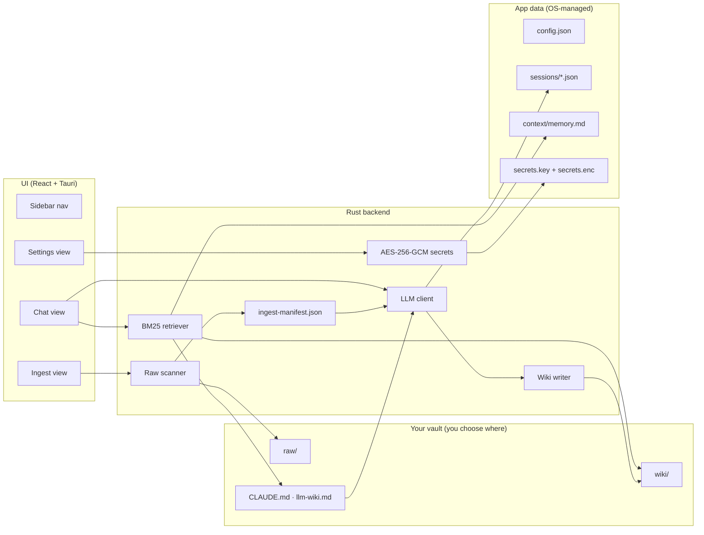
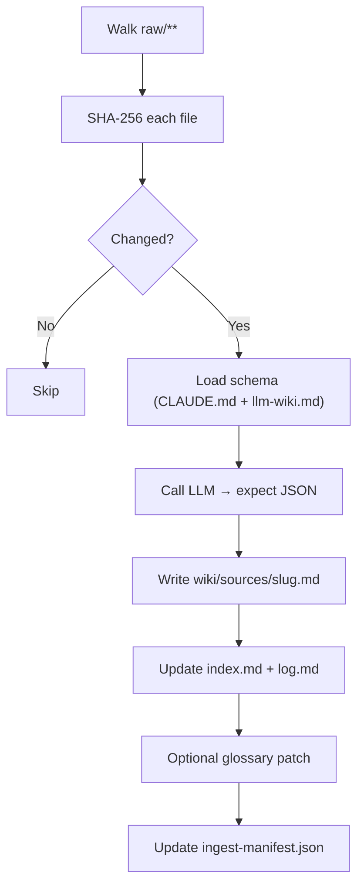
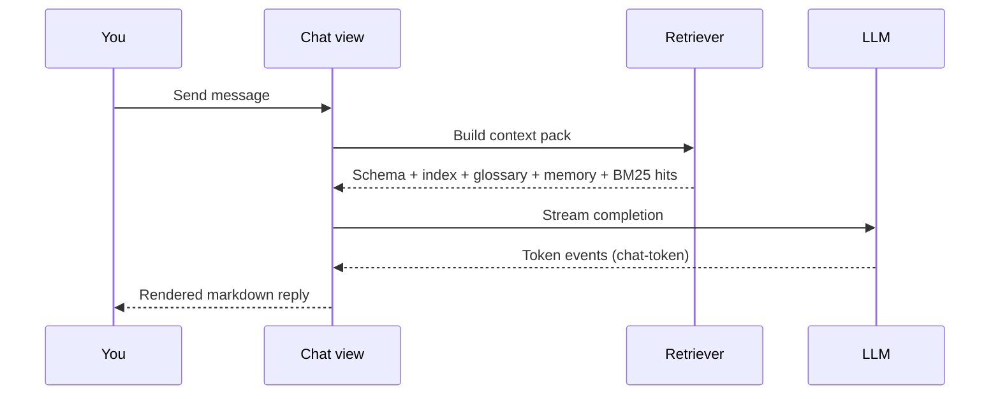

<div align="center">

# 🧠 Second Brain Lite

**Local-first desktop app for turning Markdown notes into a structured wiki — with retrieval-grounded AI chat.**

Built with [Tauri 2](https://tauri.app) · [React](https://react.dev) · [Rust](https://www.rust-lang.org) · [Tailwind CSS v4](https://tailwindcss.com)

[](./LICENSE)
[](https://tauri.app)
[](#prerequisites)

</div>

---

## What it does

Drop Markdown files into a **`raw/`** folder. Second Brain Lite reads them, calls your AI provider of choice, and writes structured **wiki pages** — summaries, index entries, a change log. Then open **Chat** to ask questions answered directly from your wiki, not from the model's training data.

No database. No cloud sync. Everything is plain Markdown on your disk, readable in any editor.

---

## Features

| | |
|---|---|
| 📥 **Smart Ingest** | SHA-256 deduplication — only re-processes files that changed |
| 💬 **Grounded Chat** | BM25 retrieval over your wiki feeds every reply |
| 🧩 **Multi-provider** | Ollama (local), OpenAI, Anthropic, Gemini, or any OpenAI-compatible API |
| 🔒 **Encrypted secrets** | API keys encrypted with AES-256-GCM — no keychain dialogs, works on every OS |
| 🎨 **Light / Dark / System** | Persistent theme preference |
| 📋 **Paste & Ingest** | Drop raw text directly into the app without saving a file first |
| 🧠 **Rolling Memory** | Summarize sessions into a persistent memory file that enriches future chats |
| 🗂️ **Session management** | Collapsible session list with per-session delete |

---

## Architecture



---

## How ingest works



The LLM returns structured JSON (`slug`, `title`, `one_line_summary`, `body_markdown`, `tags`, optional `glossary_patch`). Toggle **Full tier** for richer glossary prompts.

---

## How chat works



**Save to wiki** → writes `wiki/analyses/<slug>.md`  
**Roll up to memory** → summarises the session into `context/memory.md`, enriching future chats

---

## Prerequisites

| Requirement | Notes |
|---|---|
| **Node.js 18+** | [nodejs.org](https://nodejs.org) |
| **Rust stable** | Install via [rustup.rs](https://rustup.rs) |
| **macOS** | Xcode Command Line Tools (`xcode-select --install`) |
| **Windows** | MSVC build tools (Visual Studio Build Tools 2022) |
| **Linux** | `build-essential`, `pkg-config`, `libwebkit2gtk-4.1-dev`, `libssl-dev` |

---

## Quick start

### 1 — Clone and install

```bash
git clone https://github.com/vampokala/Second-Brain-App-Lite.git
cd Second-Brain-App-Lite
npm install
```

### 2 — Run in development

```bash
npm run tauri:dev
```

The app opens on the **Chat** view. First-time setup takes ~30 s while Rust compiles.

### 3 — Set up your vault

Go to **Settings** (⚙ in the sidebar footer):

1. **Vault** section → click **Choose** to pick a folder, then **Setup** — creates `raw/` and `wiki/` inside it.
2. Click **Copy template schemas** to install the bundled `CLAUDE.md` and `llm-wiki.md`.
3. **Provider & Models** section → choose your AI provider and enter model names.
4. **API Keys** section → paste your key and click **Save key**. Keys are encrypted on disk immediately (see [Security](#security)).

### 4 — Ingest your notes

Open **Ingest** from the sidebar:

- **Run full ingest** — scans `raw/` and processes any new or changed files.
- **Paste & ingest** — type or paste text directly; it's saved to `raw/pastes/` then ingested.
- **Roll up to memory** — distil the pasted content into your rolling memory file.

### 5 — Chat

Open **Chat**. Click **+** in the sidebar to start a session, then ask anything about your notes.

---

## App layout

```
Sidebar (collapsible)          Main area
─────────────────────────      ─────────────────────────────────
🧠 Second Brain          [<]
                               Chat / Ingest / Settings
💬 Chat          ← default
⬆  Ingest
                               Theme toggle  [☀ ⊙ ☾]  (top-right)
── Sessions ──         [+]
  • Session title      [🗑]
  • Session title      [🗑]

──────────────
⚙  Settings
```

The session list is collapsible — click the **Sessions** label to hide/show it. Hover a session to reveal the delete button.

---

## File layout

### Your vault (you control the location)

```
<vault-root>/
├── raw/                  ← drop your Markdown, PDF, DOCX, HTML here
│   └── pastes/           ← created by Paste & ingest
├── wiki/
│   ├── sources/          ← one page per ingested file
│   ├── analyses/         ← saved chat answers
│   ├── index.md
│   ├── glossary.md
│   └── log.md
├── CLAUDE.md             ← ingest contract (schema)
└── llm-wiki.md           ← wiki format contract (schema)
```

### App data (managed automatically)

| OS | Path |
|---|---|
| macOS | `~/Library/Application Support/SecondBrainLite/` |
| Windows | `C:\Users\<you>\AppData\Local\SecondBrainLite\` |
| Linux | `~/.local/share/SecondBrainLite/` |

```
SecondBrainLite/
├── config.json             ← all settings (no secrets)
├── ingest-manifest.json    ← SHA-256 per file → skip unchanged
├── secrets.key             ← AES-256 encryption key (auto-generated)
├── secrets.enc             ← encrypted API keys
├── sessions/               ← chat transcripts (JSON)
└── context/
    └── memory.md           ← rolling memory
```

---

## Security

API keys are encrypted with **AES-256-GCM** — no OS keychain prompts, no password dialogs, works identically on macOS, Windows, and Linux.

| File | What it contains |
|---|---|
| `secrets.key` | Random 32-byte AES key, generated once on first key save. `chmod 0600` on Unix; NTFS-protected on Windows. |
| `secrets.enc` | JSON envelope `{ nonce, ciphertext }` — unreadable without `secrets.key`. |

**Env vars always win** — useful for CI or scripted workflows:

| Variable | Overrides |
|---|---|
| `OPENAI_API_KEY` | Saved OpenAI key |
| `ANTHROPIC_API_KEY` | Saved Anthropic key |
| `GEMINI_API_KEY` | Saved Gemini key |
| `COMPATIBLE_API_KEY` | Saved compatible-provider key |

The threat model: protects against casual disk scans and accidental commits. Does **not** protect against malware running as your user.

---

## AI providers

| Provider | Setup |
|---|---|
| **Ollama** (local) | Start Ollama, set base URL (default `http://127.0.0.1:11434`), no API key needed |
| **OpenAI** | Paste `sk-…` key; set model e.g. `gpt-4o` |
| **Anthropic** | Paste `sk-ant-…` key; set model e.g. `claude-sonnet-4-6` |
| **Google Gemini** | Paste `AIza…` key; set model e.g. `gemini-2.0-flash` |
| **OpenAI-compatible** | Any `/v1/chat/completions` endpoint — set base URL + Bearer key |

Costs and rate limits depend on your vendor. Monitor usage on their dashboards.

---

## Configuration reference

| Setting | Where | `config.json` key |
|---|---|---|
| OS hint | Settings → Vault | `osHint` |
| Vault root | Settings → Vault → Choose | `vaultRoot` |
| Raw dir override | Settings → Vault → Advanced | `rawDir` |
| Wiki dir override | Settings → Vault → Advanced | `wikiDir` |
| Schema dir override | Settings → Vault → Advanced | `schemaDir` |
| Default provider | Settings → Provider & Models | `defaultProvider` |
| Ollama base URL | Settings → Provider & Models | `ollamaBaseUrl` |
| Model names | Settings → Provider & Models | `openaiModel`, `anthropicModel`, `geminiModel`, `compatibleModel` |

### Environment variable path overrides

| Variable | Effect |
|---|---|
| `SECOND_BRAIN_VAULT_ROOT` | Sets raw, wiki, schema relative to this root |
| `SECOND_BRAIN_RAW_DIR` | Explicit raw directory |
| `SECOND_BRAIN_WIKI_DIR` | Explicit wiki directory |
| `SECOND_BRAIN_SCHEMA_DIR` | Explicit schema directory |

---

## Building for production

```bash
npm run tauri:build
```

Outputs a signed installer / app bundle in `src-tauri/target/release/bundle/`.

---

## Troubleshooting

| Symptom | Fix |
|---|---|
| App opens blank / crashes on start | Check Rust toolchain: `rustup update stable` |
| "Could not load configuration" | Delete `config.json` in the app data dir to reset |
| Vault paths invalid | Re-run **Setup** in Settings or use the folder picker |
| Schema files missing | Click **Copy template schemas** in Settings → Vault |
| LLM ingest returns bad JSON | Try a different model or shorten the raw note |
| Ollama unreachable | Start Ollama (`ollama serve`); verify base URL; click **List models** |
| Key not saving | Check the app data dir is writable; verify `secrets.key` exists after first save |
| Windows: path not found | Use the folder picker — avoid typing paths with backslashes manually |

---

## Contributing

Issues and PRs are welcome. Please open an issue before a large change to discuss scope.

```bash
# Run frontend type check
npx tsc --noEmit

# Run full build check
npm run build
cargo build --manifest-path src-tauri/Cargo.toml
```

---

## License

MIT — see [`LICENSE`](./LICENSE).
